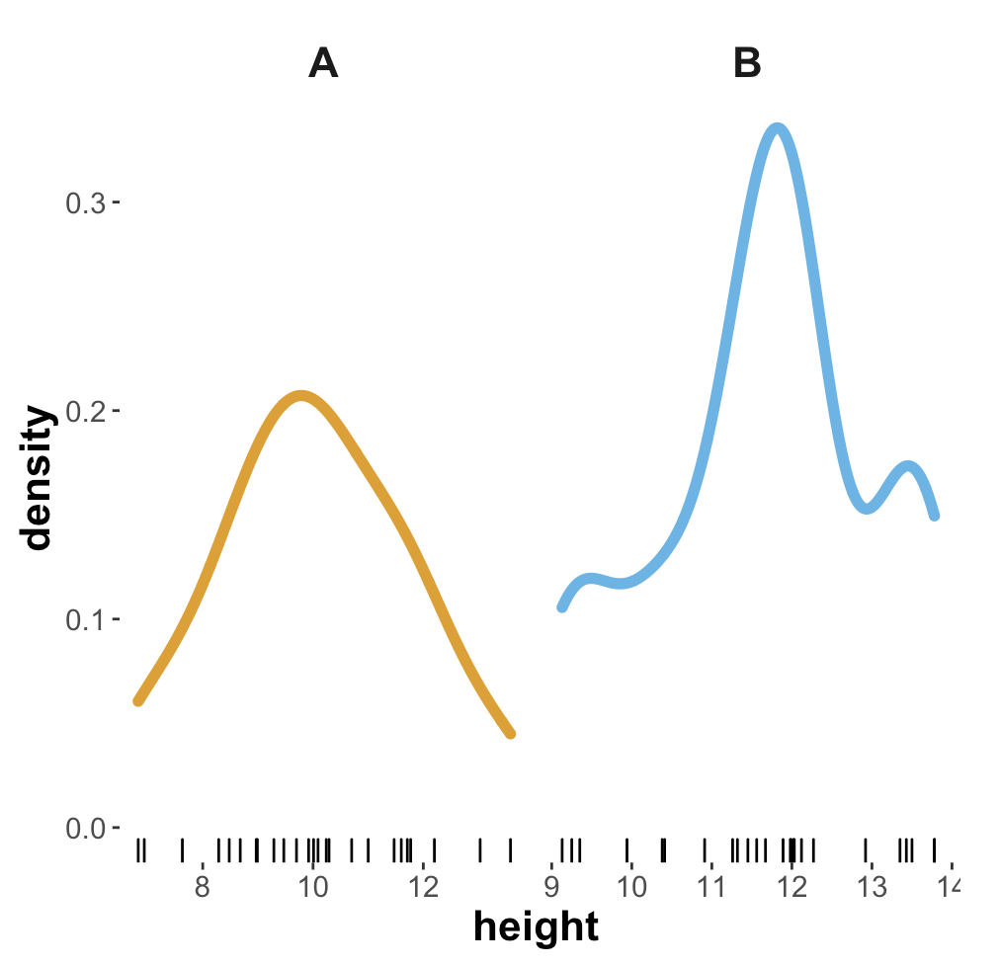
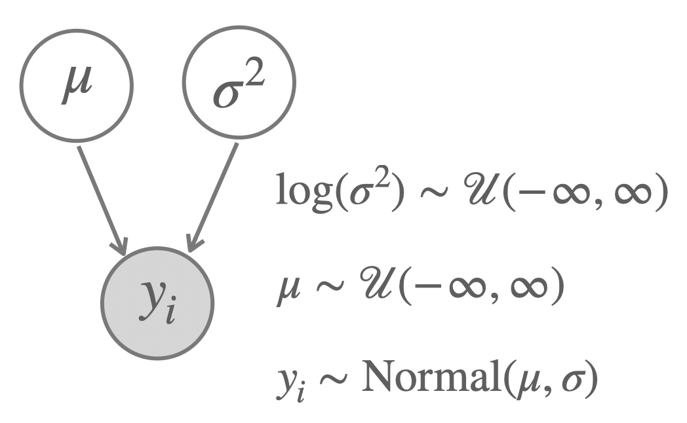
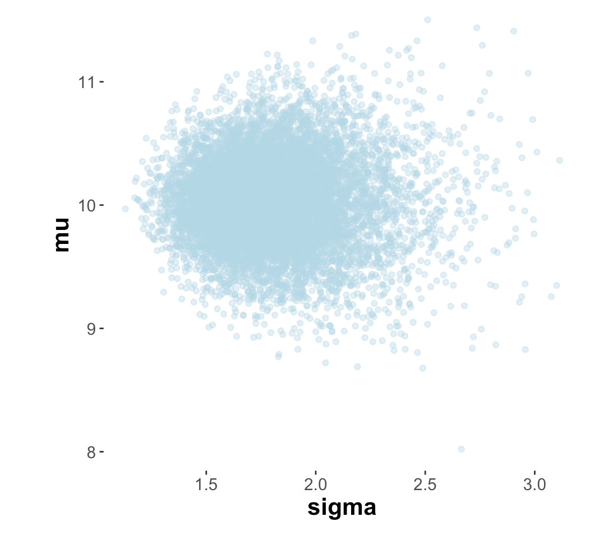
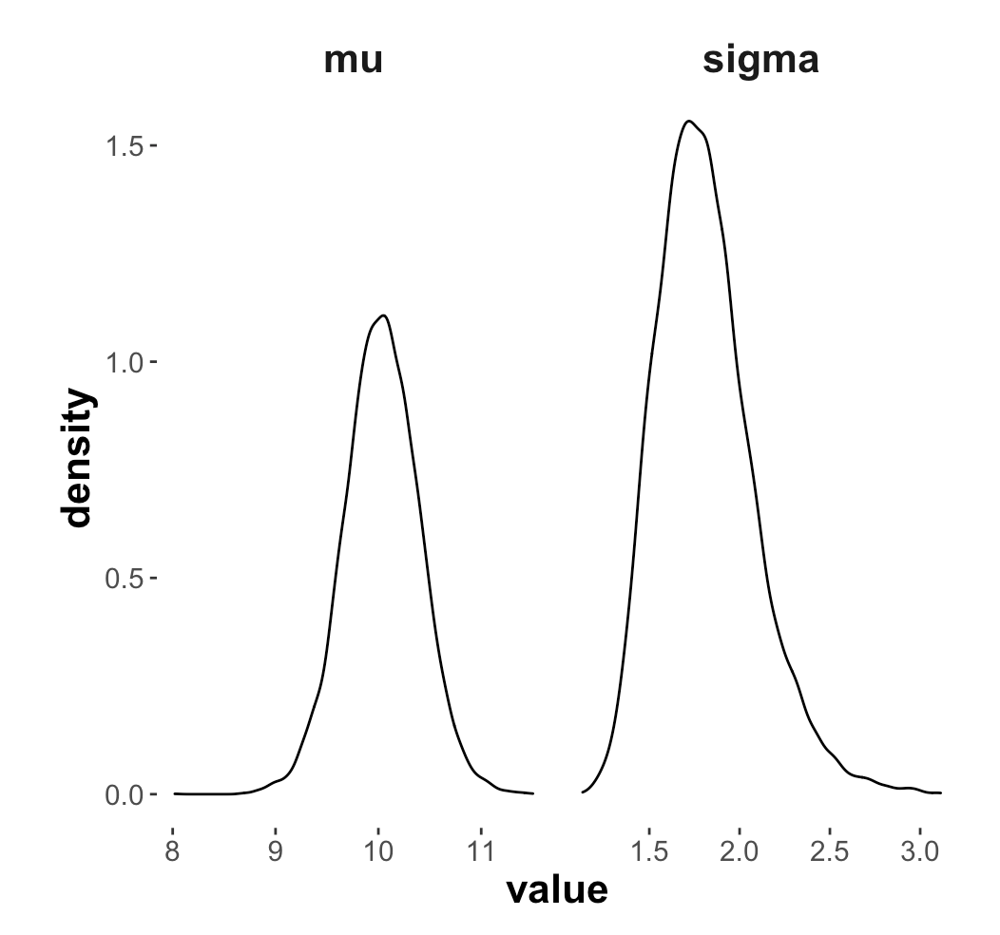
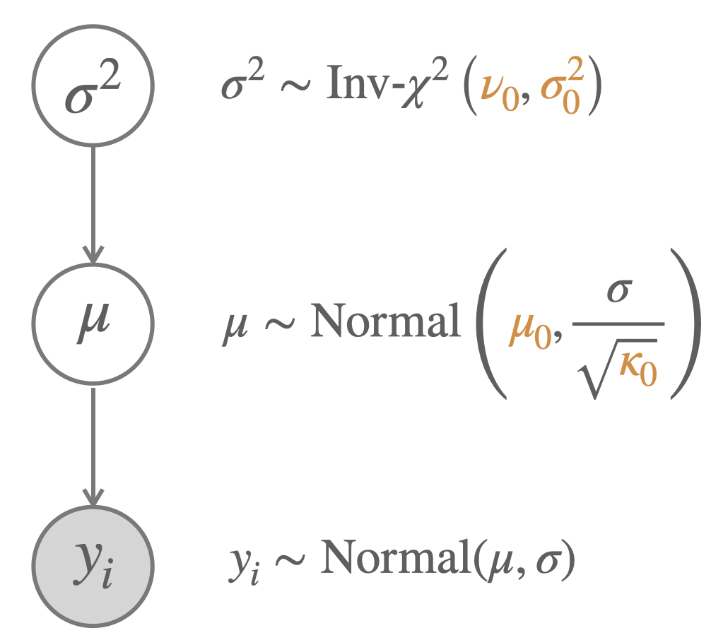
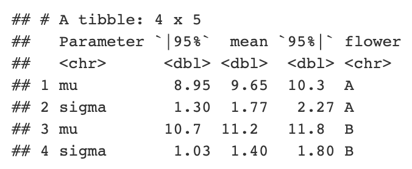

```{r setup, include=FALSE}

knitr::opts_chunk$set(
  echo = TRUE, 
  eval = T, 
  cache = FALSE, 
  message = FALSE, 
  warning = FALSE, 
  error = FALSE, 
  fig.width = 5, 
  fig.align = "center")

```

```{r libraries, message = FALSE, warning = FALSE, include = FALSE}

# package for convenience functions (e.g. ggplot2, dplyr, etc.)
library(tidyverse)

# package for Bayesian regression modeling
library(brms)

# package for visualization
library(tidybayes)

# package to visualize 
library(bayesplot)

# these options help Stan run faster
options(mc.cores = parallel::detectCores())

#devtools::install_github("michael-franke/aida-package")
library(aida)

# use the aida-theme for plotting
theme_set(theme_aida())

# global color scheme / non-optimized
project_colors = c("#E69F00", "#56B4E9", "#009E73", "#F0E442", "#0072B2", "#D55E00", "#CC79A7", "#000000")

# setting theme colors globally
scale_colour_discrete <- function(...) {
  scale_colour_manual(..., values = project_colors)
}
scale_fill_discrete <- function(...) {
   scale_fill_manual(..., values = project_colors)
} 

```


# Preliminaries

You need an additional package for this week, which provides support for a particular distribution, namely the [(scaled) inverse-$\chi^2$ distribution](https://en.wikipedia.org/wiki/Scaled_inverse_chi-squared_distribution). Please install the package 'invgamma' once using `install.packages('invgamma')` and then load the package with:

```{r}
# you may have to install this one with:
#  install.packages('invgamma')
library('invgamma')
```


# Motivation and learning goals

This course is focused on computational methods of obtaining samples that represent probability distributions. The next couple of weeks will introduce algorithms and tools for obtaining suitable samples from various models and data. Before we can embark on this, we would like to recap some basics of Bayesian inference. For recap, we would like to look at some illuminating examples, but not too boring ones either. Finally, we also do not want to run ahead of ourselves and use sampling-based methods that we do not (yet / fully) understand. Given all these desiderate, here's what we will do:

We will look at a case study (inferring mean and standard deviation of a single Gaussian) for which we can actually derive a closed form (a concrete mathematical formula expression) for the relevant Bayesian posterior (at least in non-normalized form). We then use this formula to obtain efficient samples from the Bayesian posterior. We can then work with these samples, obtained by conjugacy in a very fast and efficient way, to get familiar with sample-based approximations.

So, the main **learning goals** of this week's practical part are:

- get more practice with R, wrangling & plotting
- recap basics of Bayesian inference, in particular:
  - prior, likelihood, posterior
  - uninformative, (weakly/strongly) informative & conjugate priors
- understand the general practical appeal of sampling-based methods

**Nota bene:** You are strongly encouraged to work through the derivation of the conjugate prior structure we use here (see additional material provided). But you do not have to understand these derivations, and certainly not every detail of it, to follow the course. 

# Flower-height data

To keep matters simple and the sample size low (so as to better see effects of different priors; more on this below), we look at a (boring) fictitious data set, which we imagine to be measurements of height of two species of flowers, unflowerly named species 'A' and 'B'.

```{r}
# fictitious data from height measurements (25 flowers of two species each in cm)

heights_A <- c(6.94, 11.77, 8.97, 12.2, 8.48, 
               9.29, 13.03, 13.58, 7.63, 11.47, 
               10.24, 8.99, 8.29, 10.01, 9.47, 
               9.92, 6.83, 11.6, 10.29, 10.7, 
               11, 8.68, 11.71, 10.09, 9.7)

heights_B <- c(11.45, 11.89, 13.35, 11.56, 13.78, 
               12.12, 10.41, 11.99, 12.27, 13.43, 
               10.91, 9.13, 9.25, 9.94, 13.5, 
               11.26, 10.38, 13.78, 9.35, 11.67, 
               11.32, 11.98, 12.92, 12.03, 12.02)
```

# <span style = "color:darkgreen">Exercise 1 [SELF-PRACTICE]:</span> Wrangle, tidy, summarize and plot the data

### <span style = "color:darkgreen">Exercise 1.a [SELF-PRACTICE]:</span> Create a tidy tibble representation

Represent the data given in the two vectors above in a tibble with two columns called `species` and `height`. Call the data set `ffm_data` ("fictitious flower measures"). Make sure you understand why this is a 'tidy' representation for most common purposes (e.g., obvious ways of plotting or analyzing).

```{r}
# combine the two heights to one vector
height <- c(heights_A, heights_B)
# repeat/replicate species, each 25 times
species <- rep(c("A","B"), times=c(25,25))

# Or use: pivot_longer(cols = everything(), names_to = 'species', values_to = 'height')

# The tibble representation caps the after-comma digits, 
# but internally the numbers are still the same.
ffm_data <- tibble(species, height)
ffm_data
```

### <span style = "color:darkgreen">Exercise 1.b [SELF-PRACTICE]:</span> Get basic summary statistics

Use commands like `group_by` and `summarise` to obtain the mean and standard deviation for the height measurements of each flower species. Make use of piping!

```{r}
ffm_data %>% 
  group_by(species) %>%
  summarise(mean_height = mean(height), sd_height = sd(height))
```

### <span style = "color:darkgreen">Exercise 1.c [SELF-PRACTICE]:</span> Plot the data

Create a plot that looks (roughly / as much as possible) like the one below. (**Hint:** you get the little stripes indicating the individual data points with `geom_rug`.)

```{r}
ffm_data %>% 
  ggplot(aes(x = height, color=species)) +
  geom_density(size=2) +
  geom_rug(color="black") +
  facet_grid(~ species, scales="free") +
  theme(legend.position = "none")
```


```{r echo = F, eval = T, fig.width=2, fig.align= "center"}

```


### <span style = "color:darkgreen">Exercise 1.d [SELF-PRACTICE]:</span> Eye-ball the data

From the summary statistics obtained, and the plots you produced, would you think that it is plausible to believe that flowers of species 'B' are, on average, larger than flowers of species 'A'? (There is no true answer here, so there is no 'solution' for this exercise either; it's meant to make think: what aspects of the summary statistics / plots would you even care to look at to make up your mind?)

**Answer:** Yes, I am sure one might think there is an indication for the flowers of species B being larger in average (for that, look at the means of the two groups) but I assume there would be no significant test result proving this hypothesis.

# <span style = "color:darkgreen">Exercise 2 [SELF-PRACTICE]:</span> Bayesian posterior inference with non-informative priors

The model with uninformative priors discussed in the short video tutorial is shown below. Remember that the posterior is of the form:

$$
\begin{align*}
P(\mu, \sigma^2 \mid \mathbf{y})
& = {\color{7F2615}{P(\sigma^2 | \mathbf{y})}} \ \ \  {\color{353585}{P(\mu \mid \sigma^2, \mathbf{y})}} & \text{with:} \\
\sigma^2 \mid \mathbf{y} & \sim \mathrm{Inv}\text{-}\chi^2 \left(n-1,\ s^2 \right) \\
\mu \mid \sigma^2, \mathbf{y} & \sim \mathrm{Normal} \left (\bar{y} \mid \frac{\sigma^2}{n} \right)
\end{align*}
$$

```{r non-informative-prior-model, echo = F, fig.width=2, fig.align= "center", fig.cap="Model with non-informative priors."}

```


### <span style = "color:darkgreen">Exercise 2.a [SELF-PRACTICE]:</span> Get familiar with the sampling function

Here is a convenience function that takes a vector `data_vector` (like `height_A`) of metric observations as input and returns `n_samples` of samples from the posterior. Notice that a sample is a pair of values! Make sure you understand the code, and determine what exactly a single sample is (i.e., what numbers are returned here).

```{r}
get_samples_single_normal <- function(data_vector, n_samples = 1000) {
  # determine sample variance
  s_squared <- var(data_vector) 
  # posterior samples of the variance
  var_samples <- extraDistr::rinvchisq(
    n = n_samples, 
    nu = length(data_vector)-1, 
    tau = s_squared
  )
  # posterior samples of the mean given the sampled variance
  mu_samples <- map_dbl(
    var_samples, 
    function(var) rnorm(
      n=1, 
      mean = mean(data_vector), 
      sd = var/length(data_vector)
    )
  )
  # return pairs of values
  tibble(
    mu    = mu_samples,
    sigma = sqrt(var_samples)
  )
}
```

**Answer:** A single sample consists of two values, one for the mean and one for the variance.

### <span style = "color:darkgreen">Exercise 2.b [SELF-PRACTICE]:</span> Take samples from the posterior distribution

Generate 10,000 samples from the posterior distribution when conditioning the model with the data in `heights_A`. Store the result in a variables called `post_samples_A_noninfo`.

```{r}
post_samples_A_noninfo <- get_samples_single_normal(heights_A, n_samples=10000)
post_samples_A_noninfo
```

### <span style = "color:darkgreen">Exercise 2.c [SELF-PRACTICE]:</span> Plot the posterior samples

Produce a scatter plot (using `geom_point`) showing each pair of mean and standard deviation sampled from the posterior. In a seperate plot, plot a density plot of the marginal distributions of both variables. The outcome could look (roughly) like the plots below.

```{r echo = F, eval = T, fig.width=2, fig.align= "center"}

```

```{r echo = F, eval = T, fig.width=2, fig.align= "center"}

```


```{r}
post_samples_A_noninfo %>% 
  ggplot(aes(x = sigma, y = mu)) +
  geom_point(alpha=0.2, color="#b1cfff")
  #scale_y_continuous(breaks = c(8,9,10,11), limits = c(8,11)) +
  #scale_x_continuous(breaks = c(1.5,2,2.5,3))
```

```{r}
post_samples_A_noninfo %>% 
  pivot_longer(cols = everything(), names_to = "parameter", values_to = "value") %>% 
  ggplot(aes(x = value)) +
  geom_density() +
  facet_grid(~ parameter, scales = "free")
```

### <span style = "color:darkgreen">Exercise 2.e [SELF-PRACTICE]:</span> Interpret the plots of the posterior samples

What do these plots show? What do we learn from it? Please be mindful of the very words you would use to describe these pictures.

**Answer:** The scatter plot shows the correlation between the mean and the standard deviation of the sampled heights, in that when the sd gets bigger, the mean also gets bigger, thus the two are not independent.  
The density plot indicates our belief update given the data. For instance, like parameter values for the mean lie approximately between 9.7 and 10.5.

### <span style = "color:darkgreen">Exercise 2.f [SELF-PRACTICE]:</span> Get and interpret a summary statistic for the posterior samples

Here is a convenience function for obtaining the mean and 95% credible interval from a vector of samples:

```{r}
# convenience function

#' Summarize single vector of samples (lower/upper 95% CredInt & mean)
#' 
#' @param samples numeric vector of samples
#' 
#' @return tibble
#' @export
summarize_sample_vector <- function(samples, name = '') {
    tibble(
      Parameter = name,
      '|95%' = HDInterval::hdi(samples)[1],
      mean  = mean(samples),
      '95%|' = HDInterval::hdi(samples)[2]
    )
}
```

Use this function to obtain a representation similar to the table below, which shows the summary statistics for the posterior samples obtained so far. (Hint: maybe use `rbind`.)

```{r}
CI_mu <- summarize_sample_vector(post_samples_A_noninfo$mu, name = "mean")
CI_sigma <- summarize_sample_vector(post_samples_A_noninfo$sigma, name = "stddev")

ffm_A_summary <- rbind(CI_mu, CI_sigma)
ffm_A_summary
```

You should be able to understand this information, and to be able to link it to what you see in the above marginal density plots.

# <span style = "color:firebrick">Exercise 3 [HOMEWORK]:</span> Bayesian posterior inference with conjugate prior 

We are now going to look at the model with conjugate priors, as described in the tutorial video. Below is a picture of that model. 

```{r conjugate-prior-model, echo = F, fig.align = "center", fig.cap="Model with conjugate priors."}

```

With this prior structure, the posterior is of the form:

$$
\begin{align*}
P(\mu, \sigma^2 \mid \mathbf{y})
& = {\color{7F2615}{P(\sigma^2 | \mathbf{y})}} \ \ \  {\color{353585}{P(\mu \mid \sigma^2, \mathbf{y})}} & \text{with:} \\
\sigma^2 \mid \mathbf{y} & \sim {\color{7F2615}{\mathrm{Inv}\text{-}\chi^2 \left({\color{3F9786}{\nu_1}},\ {\color{3F9786}{\sigma^2_1}} \right)}} \\
\mu \mid \sigma^2, \mathbf{y} & \sim {\color{353585}{\mathrm{Normal} \left ({\color{3F9786}{\mu_1}}, \frac{\sigma}{\sqrt{\color{3F9786}{\kappa_1}}} \right)}} & \text{where:} \\
{\color{3F9786}{\nu_1}} & = \nu_0 + n \\
\nu_n{\color{3F9786}{\sigma_1^2}} & =  \nu_0 \sigma_0^2 + (n-1) s^2 + \frac{\kappa_0 \ n}{\kappa_0 + n} (\bar{y} - \mu_0)^2 \\
{\color{3F9786}{\mu_1}} & = \frac{\kappa_0}{\kappa_0 + n} \mu_0 + \frac{n}{\kappa_0 + n} \bar{y} \\
{\color{3F9786}{\kappa_1}} & = \kappa_0 + n
\end{align*}
$$

### <span style = "color:firebrick">Exercise 3.a [HOMEWORK]:</span> Sample from the prior

Here is a convenience function to sample from the 'normal inverse-$\chi^2$' prior. 

```{r}
sample_Norm_inv_chisq <- function(
  n_samples = 10000, 
  nu = 1, 
  var = 1, 
  mu = 0, 
  kappa = 1
  ) 
{
  var_samples <- extraDistr::rinvchisq(
    n   = n_samples, 
    nu  = nu, 
    tau = var
  )
  mu_samples <- map_dbl(
    var_samples, 
    function(s) rnorm(
      n    = 1, 
      mean = mu, 
      sd   = sqrt(s/kappa)
    )
  )
  tibble(
    sigma = sqrt(var_samples),
    mu    = mu_samples
  )
}
```

In the code below, we use this function to plot 10,000 samples from the prior with a particular set of parameter values. Notice the line `  filter(abs(value) <= 10)` which is useful for an informative plot (try commenting it out: what does that tell you about the range of values reasonably likely to get sampled?).

```{r}
# samples from the prior
samples_prior_1 <- sample_Norm_inv_chisq(
  nu = 1, 
  var = 1, # a priori "variance of the variance"
  mu = 0, 
  kappa = 1
)

samples_prior_1 %>% 
  pivot_longer(cols = everything(), names_to = "parameter", values_to = "value") %>% 
  filter(abs(value) <= 10) %>% 
  ggplot(aes(x = value)) +
  geom_density() + facet_grid(~parameter, scales = "free")
```


**Answer:** The range of parameter values for both mu and sigma are very variant but sampled mu and sigma are most likely lying around the mean of the parameters (obviously) and are heavily influenced by the sample variance, which in this case is just one which is why the sampled parameter values do not diffuse too much.


To get comfortable with this 'normal inverse-$\chi^2$' distribution, fill in the `XXX` in the following code box (possibly removing or altering parts of the plotting code if you need to) to find parameter values that encode a prior belief according to which credible values of $\sigma$ are not much bigger than (very roughly) 7.5, and credible values of $\mu$ lie (very roughly) in the range of 15 to 25. (Hint: intuit what the meaning of each parameter value is by a trial-error-think method.) The plot you generate could look roughly like the one below. 

(Motivation for the exercise: you should get familiar with this distribution, and also realize that it is clunky and that you might want to use a different prior structure in order to encode specific beliefs ... which is exactly why we might want to be more flexible and go beyond conjugate priors in some cases.)

```{r}
# samples from the prior
samples_prior_2 <- sample_Norm_inv_chisq(
  nu    = 2, 
  var   = 3, 
  mu    = 20,
  kappa = 2
)

rbind(
  summarize_sample_vector(samples_prior_2$mu, "mu"),
  summarize_sample_vector(samples_prior_2$sigma, "sigma")
)

samples_prior_2 %>% 
  pivot_longer(cols = everything(), names_to = "parameter", values_to = "value") %>% 
  filter(!(parameter == "mu" & (value >= 40 | value <= 0))) %>% 
  filter(!(parameter == "sigma" & value >= 10)) %>% 
  ggplot(aes(x = value)) +
  geom_density() + 
  facet_grid(~parameter, scales = "free")
```

### <span style = "color:firebrick">Exercise 3.b [HOMEWORK]:</span> Get posterior estimates for different priors

Here is a convenience function for obtaining posterior samples for the conjugate prior model, taking as input a specification of the prior beliefs.


```{r}
get_samples_single_normal_conjugate <- function(
  data_vector, 
  nu    = 1, 
  var   = 1, 
  mu    = 0, 
  kappa = 1,
  n_samples = 1000
) 
{
  n <- length(data_vector)
  sample_Norm_inv_chisq(
    n_samples = n_samples,
    nu        = nu + n, 
    var       = (nu * var + (n-1)*var(data_vector) + (kappa * n)/ (kappa + n)) / (nu + n), 
    mu        = kappa / (kappa + n) * mu + n / (kappa + n) * mean(data_vector), 
    kappa     = kappa + n
  )
}
```

The code below calls this function to obtain samples from the posterior for two different models. Inspect the outcome in the final table and explain the difference in posterior inference of the variable `mu`. (Hint: plot the priors of model 3.)

```{r}
# posterior samples for prior 1
post_samples_A_conjugate_1 <- get_samples_single_normal_conjugate(
  heights_A, 
  nu    = 1, 
  var   = 1, 
  mu    = 0, 
  kappa = 1,
  n_samples = 10000
)

# posterior samples for prior 3
post_samples_A_conjugate_3 <- get_samples_single_normal_conjugate(
  heights_A, 
  nu    = 1, 
  var   = 1/1000, 
  mu    = 40, 
  kappa = 10,
  n_samples = 10000
)

rbind(
  summarize_sample_vector(post_samples_A_conjugate_1$mu,    "mu") %>% mutate(model = 1),
  summarize_sample_vector(post_samples_A_conjugate_1$sigma, "sigma") %>% mutate(model = 1),
  summarize_sample_vector(post_samples_A_conjugate_3$mu,    "mu") %>% mutate(model = 3),
  summarize_sample_vector(post_samples_A_conjugate_3$sigma, "sigma") %>% mutate(model = 3)
)

# Let's use the hint and plot the priors with the above given 
# parameter values for the normal inverse chi-squared distribution.
samples_prior_3 <- sample_Norm_inv_chisq(
  nu    = 1, 
  var   = 1/1000, 
  mu    = 40,
  kappa = 10
)

# Bind summaries together row-wise.
rbind(
  summarize_sample_vector(samples_prior_3$mu, "mu"),
  summarize_sample_vector(samples_prior_3$sigma, "sigma")
)

# Plot the sampled parameter values of the prior distribution for mu and sigma.
samples_prior_3 %>% 
  pivot_longer(cols = everything(), names_to = "parameter", values_to = "value") %>% 
  filter(!(parameter == "mu" & (value >= 40.25 | value <= 39.75))) %>% 
  filter(!(parameter == "sigma" & value >= 0.5)) %>% 
  ggplot(aes(x = value)) +
  geom_density() + 
  facet_grid(~parameter, scales = "free")
```


**Answer:** The actual method of posterior inference is the same for both models. Yet, by changing the parameter values of the priors of the model we get another result. Mu depends on sigma, which is why the tweaking of 'nu' and 'var' for sigma also results in different values for mu. By changing the variance of the prior distribution ("variance of the variance"), the sampled values lie in a narrower range which consequently entails narrower values for mu as well. Furthermore (and with greatest impact on the posterior parameter values), the most likely parameter values for mu now get shifted to lie around 40 by setting the parameter value mu of the prior to 40. Finally, that lead the most likely values of the posterior parameter values for mu to lie around 18.6 for model 3, whereas for model 1 they lie around 9.65.


# <span style = "color:firebrick">Exercise 4 [HOMEWORK]:</span> Comparing group means

### <span style = "color:firebrick">Exercise 4.a [HOMEWORK]:</span> Compare the posterior means of flowers A and B

Let's face our research question: should we believe that flowers of type B are higher, on average, than flowers of type A? Use the (conjugate) prior of model 1 from above to also take 10,000 samples from the posterior when conditioning with the data in `heights_B`. Store the results in a vector called `post_samples_B_conjugate_1`.

```{r}
post_samples_B_conjugate_1 <- get_samples_single_normal_conjugate(
  heights_B, 
  nu    = 1, 
  var   = 1, 
  mu    = 0, 
  kappa = 1,
  n_samples = 10000
)
```

### <span style = "color:firebrick">Exercise 4.b [HOMEWORK]:</span> Compare summaries of posterior samples

Make a table like the one below that compares the summaries of the posterior samples for both data sets under the same model 1.

```{r echo = F, eval = T, fig.width=2, fig.align= "center"}

```

```{r}
rbind(
  summarize_sample_vector(post_samples_A_conjugate_1$mu,    "mu") %>% mutate(flower = "A"),
  summarize_sample_vector(post_samples_A_conjugate_1$sigma, "sigma") %>% mutate(flower = "A"),
  summarize_sample_vector(post_samples_B_conjugate_1$mu,    "mu") %>% mutate(flower = "B"),
  summarize_sample_vector(post_samples_B_conjugate_1$sigma, "sigma") %>% mutate(flower = "B")
)
```

### <span style = "color:firebrick">Exercise 4.c [HOMEWORK]:</span> Interpret the results

What would you conclude from this last table of results regarding our research question?

**Answer:** Using Lindley's point-valued approach the data suggests that, even though species A has a higher variance in sampled values, the 95% credible intervals do not even overlap. While the mu-CI for species A is [9,10.4] with a mean of 9.65, values for mu for species B lie in [10.7,11.8] with a mean of 11.2, which is why I would conclude from this that the height of flowers of species B is more likely to be greater than for those of species A.

# <span style = "color:darkorange">Exercise 5 [BONUS]:</span> Posterior beliefs about the difference in means

### <span style = "color:darkorange">Exercise 5.a [BONUS]:</span> Dealing with derived random variables in a sampling-based approach

Given the samples at hand, how could you obtain a measure of the posterior beliefs in the difference between the means of flower types. Concretely, if $X_{\mu_A}$ ($X_{\mu_B}$) is the random variable describing the posterior beliefs about $A$ ($B$), can you derive any information about the derived random variable $\delta = X_{\mu_B} - X_{\mu_B}$? 

**Answer:** Yes, by getting the delta of mu of our posterior samples, we can use Lindley's point-valued or Kruschke's ROPE-d approach and the area under our posterior distribution curve for our value of interest to derive a degree of belief in the event of a certain value for delta.

### <span style = "color:darkorange">Exercise 5.b [BONUS]:</span> Quantifying our posterior belief in a large positive difference under model 1

What is our degree of belief in the event $\delta >= 1$, given the data and model 1?

```{r}
# Delta = posterior samples for mu prior of species B - posterior samples for mu prior of species A
delta_1 <- post_samples_B_conjugate_1$mu - post_samples_A_conjugate_1$mu

# Get 95% credible Interval for our delta parameter.
CI_1 <- summarize_sample_vector(delta_1, name="delta")
CI_1

# Let's visualize the posterior samples for the delta prior
tibble(parameter = "delta_1", value = delta_1) %>% 
  ggplot(aes(x = delta_1)) + 
  geom_density() +
  geom_vline(xintercept = CI_1$`|95%`[1], color="blue") +
  geom_vline(xintercept = 1, color="red") +
  geom_vline(xintercept = CI_1$`95%|`[1], color="blue")

# Now we evaluate the cumulative density in order to get 
# a certain degree of belief regarding our hypothesis of delta >= 1.
belief_1 <- ecdf(delta_1)
# The argument 1 is our delta
1 - belief_1(1)
```

**Answer:** Using Lindley's point-valued approach we can conclude that our point value of interest (delta = 1) is in the 95% credible interval and first and foremost, the mean of the sampled posteriors for the delta prior is 1.56. Also the cumulative function outputs the area under the curve to be roughly 0.9 indicating a high degree of belief (90%) in the event $\delta >= 1$, given the data and model 1.

### <span style = "color:darkorange">Exercise 5.c [BONUS]:</span> Quantifying our posterior belief in a large positive difference under model 3

What is is our degree of belief in the event $\delta >= 1$, given the data and model 3?

```{r}
post_samples_B_conjugate_3 <- get_samples_single_normal_conjugate(
  heights_B, 
  nu    = 1, 
  var   = 1/1000, 
  mu    = 40, 
  kappa = 10,
  n_samples = 10000
)

# Delta = posterior samples for mu prior of species B - posterior samples for mu prior of species A
delta_3 <- post_samples_B_conjugate_3$mu - post_samples_A_conjugate_3$mu

# Get 95% credible Interval for our delta parameter.
CI_3 <- summarize_sample_vector(delta_3, name="delta")
CI_3

# Let's visualize the posterior samples for the delta prior
tibble(parameter = "delta_3", value = delta_3) %>% 
  ggplot(aes(x = delta_3)) + 
  geom_density() +
  geom_vline(xintercept = CI_3$`|95%`[1], color="blue") +
  geom_vline(xintercept = 1, color="red") +
  geom_vline(xintercept = CI_3$`95%|`[1], color="blue")

belief_3 <- ecdf(delta_3)
1 - belief_3(1)
```

**Answer:** Using Lindley's point-valued approach we can conclude that our point value of interest (delta = 1) is in the 95% credible interval and first and foremost, the mean of the sampled posteriors for the delta prior is 1.16. Also the cumulative function outputs the area under the curve to be roughly 0.66 indicating a high degree of belief (66%) in the event $\delta >= 1$, given the data and model 3.

### <span style = "color:darkorange">Exercise 5.d [BONUS]:</span> Interpreting the results

Explain the difference in results between model 1 and 3.

```{r}
rbind(CI_1, CI_3)
```

**Answer:** Since the priors of the two models differ in the values of their parameters, the difference in means between species A and B is larger, in average, for model 1 than for model 3. Particularly, the much smaller variance for the variance prior of model 3 cause the difference in means to be greater in model 1.
