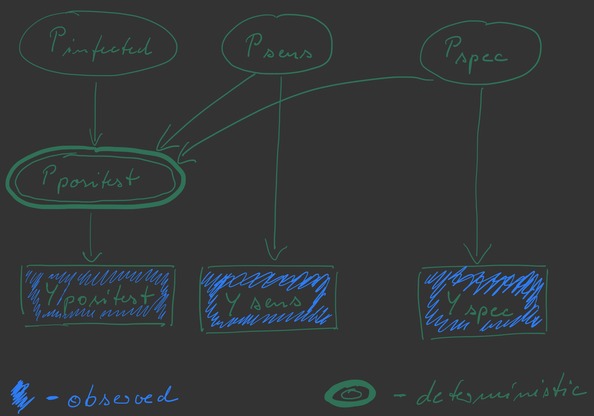

```{r setup, include=FALSE}

knitr::opts_chunk$set(echo = TRUE, cache = F, message = FALSE, warning = FALSE, error = FALSE, fig.width = 5, fig.align = "center")

```

```{r libraries, message = FALSE, warning = FALSE, include = FALSE}

# package for convenience functions (e.g. ggplot2, dplyr, etc.)
library(tidyverse)

# package for Bayesian regression modeling
library(brms)

# package for visualization
library(tidybayes)

# package to visualize 
library(bayesplot)

# package to communicate with Stan
library(rstan)

# these options help Stan run faster
options(mc.cores = parallel::detectCores())

#devtools::install_github("michael-franke/aida-package")
library(aida)

# use the aida-theme for plotting
theme_set(theme_aida())

# global color scheme / non-optimized
project_colors = c("#E69F00", "#56B4E9", "#009E73", "#F0E442", "#0072B2", "#D55E00", "#CC79A7", "#000000")

# setting theme colors globally
scale_colour_discrete <- function(...) {
  scale_colour_manual(..., values = project_colors)
}
scale_fill_discrete <- function(...) {
   scale_fill_manual(..., values = project_colors)
} 

```

# Instructions

- Use the file `08-exercises.Rmd`, solve the exercises marked as homework, and save the file with your student number and name.
- ‘Knit’ the document to produce a HTML file.
  - **include the other JS and CSS files that came with the ZIP file for this week in order to produce nicely looking Stan code in the HTML**
- **include the Stan code you write in the Rmarkdow (see example in exercise 1 below), even if you also include a seperate file to run that model from**
- Please do not suppress the code in the HTML-Output!
  - **do suppress the output of Stan by including the flag `results = "hide"` in the r chunk calling the `stan`  function (see example in self-practice exercise 1)**
- Create a ZIP archive called “MATRIKELNR_Lastname_Firstname_ABDA_Week4.zip” containing:
  - an R Markdown file “MATRIKELNR_Lastname_Firstname_ABDA_Week4.Rmd”
  - a knitted HTML document “MATRIKELNR_Lastname_Firstname_ABDA_Week4.html”
  - **all of your Stan code files**
  - **the auxilliary JS and CSS files for syntax highlighting of Stan code**
- Upload the ZIP archive on Stud.IP in the homework folder before the deadline. You may upload as many times as you like before the deadline, only your final submission will count.

# Preliminaries

We need the package `rstan` installed and loaded for this week's exercises.

We are going to set a seed, so that results from (pseudo-)random executions are repeatable. 

```{r}
set.seed(1969)
```


# Motivation and learning goals

The main **learning goals** of this week's practical part are:

- become familiar with Stan
- see a simple and some increasingly more difficult models implemented in Stan
- become comfortable with minor manipulations to Stan programs
- understand robust (regression) modeling 

# <span style = "color:darkgreen">Exercise 1 [SELF-PRACTICE]:</span> Inferring a single Gaussian: priors & posterior predicitives

We are going to, yet again (!), estimate the joint posterior of the mean $\mu$ and standard deviation $\sigma$ that could have generated the following fictitious (flower) data:

```{r}
# flower height data (as before)
heights_A <- c(6.94, 11.77, 8.97, 12.2, 8.48, 
               9.29, 13.03, 13.58, 7.63, 11.47, 
               10.24, 8.99, 8.29, 10.01, 9.47, 
               9.92, 6.83, 11.6, 10.29, 10.7, 
               11, 8.68, 11.71, 10.09, 9.7)
# store the data in a vector with a better name & record its length
y <- heights_A
N <- length(y)
```

## 1.a Minimal model with improper priors

In a first minimal model, we assume improper priors on $\mu$ and $\sigma$, assuming that every pair of values for these parameters is equally likely *a priori*, except that $\sigma$ ought to be positive. The Stan code for this model is:

```{stan, output.var="minimal-model-single-Gaussian", eval = F}
data {
  int<lower=1> N ;
  vector[N] y ;
}
parameters {
  real mu ;
  real<lower=0> sigma ;
} 
model {
  y ~ normal(mu, sigma) ;
}
```

Notice that improper priors are used here, because we didn't specify any prior on $\mu$ or $\sigma$. We only declared that $\sigma$ has a lower bound at 0.

We prepare the data to be fed into Stan:

```{r}
# prepare the data for Stan
dataList = list(y = y, N = N)
```

And then run the model (which is also stored in file `ADA-W08-Ex1-single-Gaussian.stan`):

```{r, results="hide"}
# fit the model to the data
fit_1a = stan(
  file = 'ADA-W08-Ex1a-single-Gaussian.stan',
  data = dataList
)
```

We can inspect a summary of the `stanfit` object in variable `fit_1a`:

```{r}
fit_1a
```

We can interpret the information about the quantiles, means, R-hat and number of efficient samples, as before (in the context of using the `brms` package).

## 1.b Adding prior information and obtaining samples from the posterior predictive distribution

We are going to add wide relatively uninformative priors, just to see how this looks like. We do not expect this to change the posterior inference (much). In particular, we are going to set the prior of $\mu$ to a normal distribution with mean 0 and standard deviation 100. We are going to use a [truncated cauchy distribution](http://bois.caltech.edu/distribution_explorer/continuous/halfcauchy.html#:~:text=In%20Stan%2C%20a%20Half%2DCauchy,of%20the%20Half%2DCauchy%20distribution) for the prior on $\sigma$ with mean/mode 0, truncated at 0 and spread parameter 10. [It is not important for our purposes what exactly this distribution is. We use it here for its very thick tails. See description in link above, if you are interested.]

We are also going to add a `generated quantities` block, in which we will draw samples from the **posterior predictive** distribution (see Lambert pages 378 ff.). Intuitively, the posterior predictive distribution gives us the probability with which we expect, given our *posterior* beliefs about the model's parameters, how likely a future or hypothetical data observation, called `yrep` here (for *repeat data*), is. Formally, if the observed data is $y_\text{obs}$, the posterior predictive distribution is defined as:

$$
P(y_\text{rep} \mid y_\text{obs}) = \int P(\theta \mid y_\text{obs}) P(y_\text{rep} \mid \theta) \ \text{d} \theta
$$

As usual, we can approach this integral with sampling: we will not compute this, but take samples from the posterior predictive distribution. In this case, what we need are samples of $\theta$ from the posterior (which Stan happily provides) and then a sample of fake/hypothetical/repeat data $y_\text{rep}$ for each sampled parameter vector $\theta$. We can do this in Stan, as follows:

```{stan, output.var="minimal-model-single-Gaussian", eval = F}
data {
  int<lower=1> N ;
  vector[N] y ;
}
parameters {
  real mu ;
  real<lower =0> sigma ;
} 
model {
  // priors for parameters
  mu ~ normal(0,100);
  sigma ~ cauchy(0,10);
  y ~ normal(mu, sigma) ;
}
generated quantities {
  // samples from the posterior predictive distribution
  // notice that, given the code above, mu and sigma are constraint to
  // be samples from the posterior at run time
  real yrep;
  yrep = normal_rng(mu, sigma); 
}
```

<span style = "color:gray">[NB: normally, we would take samples of repeat data as structured chunks of the same size and shape as the original data. So, we would often take as repeat data another set of $N$ samples, just like our $y_\text{obs}$ has $N$ samples. This is what Lambert does on page 379. But since we only have one continuous measure here and it is simpler to work with, we take as many samples from the posterior predictive in this case as we take samples from the posterior over model parameters.]</span>

Let's run this model with the obvious:

```{r, results="hide"}
# fit the model to the data
fit_1b = stan(
  file = 'ADA-W08-Ex1b-single-Gaussian-prior-postpred.stan',
  data = dataList
)
```

We can then inspect the fitted values:

```{r}
fit_1b
```

As expected, given that the priors are reasonably unconstrained (given the range of plausible values for this data set), the estimates for $\mu$ and $\sigma$ are much the same.

What should we make of the samples from the posterior predictive distribution? - A common use case of these is to do what is called **visual posterior predictive checks**. The idea is that, by plotting relevant aspects of $y_\text{obs}$ and $y_\text{rep}$, we can *visually check* whether the original data has important aspects that the repeat data does not. Here, in this simple model and data set, we do not expect any trouble, of course. But we'll look at this case for a comparison to a case discussed below.

So, let's plot the repeat samples in a manner that is informative regarding the question of whether $y_\text{obs}$ and $y_\text{rep}$ have noteworthy structural differences that should make us worried about the model we used.

```{r}
# extract samples from 'stanfit' object in a tidy format
post_samples_1b <- tidybayes::tidy_draws(fit_1b)
# plot posterior predictive samples against the original data
post_samples_1b %>% ggplot(aes(x = yrep)) +
  geom_density(color = project_colors[3], size = 2) +
  geom_point(
    data = tibble(yrep = y, y = 0),
    aes(y = y),
    color = project_colors[1],
    size = 2
  ) +
  xlab("observed & repeat data")
```

We see the distribution of repeat data in green and the original data as orange dots along the $x$-axis. We can interpret this as follows. Given our posterior beliefs (given model and data), be would expect data to be distributed like the green line suggests. The original data (which we used to obtain these beliefs) looks plausibly like samples from this distribution. So, visually, with the implied vagueness, and for this way of comparing $y_\text{obs}$ and $y_\text{rep}$ we may conclude that *this* visual posterior predictive check gives us no ground for alarm.

**Important:** Passing a single (visual) posterior predictive check (PPC) is nothing to write home about. Failing a PPC, on the other hand, is bad *if* the aspect that is not captured by $y_\text{rep}$ but present in $y_\text{obs}$ is theoretically or technically relevant.

## 1.c Obtaining samples from the prior predictive distribution

Next to the posterior predictive distribution, we can also look at a models **prior predictive distribution**. Intuitively, the prior predictive distribution gives us the probability with which we expect, given our *prior* beliefs about the model's parameters, how likely a future or hypothetical data observation, referred to as $y_\text{pred}$ here (for *predicted data*), is. Formally, the prior predictive distribution is defined as:

$$
P(y_\text{pred}) = \int P(\theta) P(y_\text{rep} \mid \theta) \ \text{d} \theta
$$

Algorithmically, we can get samples from the prior predictive distribution by obtaining samples from the prior over $\theta$ and then sampling a $y_\text{rep}$ from the likelihood function, given the sampled $\theta$. 

Try to implement this in Stan by completing the following model code:

```{stan, output.var="minimal-model-single-Gaussian-prior-pred", eval = F}
functions {
  // we need to define our own _rng function because
  // Stan (currently) doesn't allow truncated sampling functions
  real half_cauchy_rng(real spread) {
    return(fabs(cauchy_rng(0, spread)));
  }
}
data {
  int<lower=1> N ;
  vector[N] y ;
}
parameters {
  real mu ;
  real<lower =0> sigma ;
} 
model {
  // priors for parameters
  mu ~ normal(0,100);
  sigma ~ cauchy(0,10);
  y ~ normal(mu, sigma);
}
generated quantities {
  // samples from the prior predictive distribution
  real mu_prior;
  real<lower =0> sigma_prior;
  real ypred; 
  mu_prior = normal_rng(0,100)
  sigma_prior = half_cauchy_rng(10)
  ypred = normal_rng(mu_prior, sigma_prior)
}
```

Hints: As it stands, this code samples from the posterior. So you need to introduce new variables like `mu_prior` and `sigma_prior` that contain samples from the priors. You do this using notation like `normal_rng()` and `half_cauchy_rng()` inside the `generated quantities` block. In that block, you also declare the variables (including any upper and/or lower bounds). Notice that we had to declare our own function `half_cauchy_rng()` for sampling from a truncated distribution. This easy implementation above works only for truncation at zero, of course. 

The solution can be found in file `ADA-W08-Ex1c-single-Gaussian-priorpred.stan`.

If you have written your own Stan code for prior predictive samples, run your file to get samples, like so:

```{r, results = "hide"}
fit_1c = stan(
  file = 'ADA-W08-Ex1c-single-Gaussian-priorpred.stan',
  data = dataList
)
```

Let's finally make a plot similar to the one in Exercise 1b, to see that the data clearly does not look like representative samples from the prior predictive distribution (which is totally unsurprising, of course!). NB: We restrict the plot of `ypred` to samples of that measure between -50 and 50.

```{r}
# extract samples from 'stanfit' object in a tidy format
post_samples_1c <- tidybayes::tidy_draws(fit_1c) %>% 
  filter(abs(ypred) <= 50)
# plot posterior predictive samples against the original data
post_samples_1c %>% ggplot(aes(x = ypred)) +
  geom_density(color = project_colors[3], size = 2) +
  geom_point(
    data = tibble(ypred = y, y = 0),
    aes(y = y),
    color = project_colors[1],
    size = 2
  ) +
  xlab("observed & repeat data")

```

# <span style = "color:firebrick">Exercise 2 [HOMEWORK]:</span> Outlier-robust inference

Using Stan, we have full control over our model. To see a case where this is useful, let's consider **robust regression**. Remember that fitting a single Gaussian is like fitting an intercept-only linear regression model. So, what we do here applies to other regression models applied to metric data $y$, too. We are going to see that using a normal likelihood function makes our models very sensitive to outliers. To make them more robust against outliers we can change the likelihood function to using a [Student $t$ distribution](http://bois.caltech.edu/distribution_explorer/continuous/student_t.html), which has thicker tails.

## 2.a Normal likelihood with outliers: what's the problem? (3 points)

Let's add two rather extreme outliers to our data of flower heights:

```{r}
y_prime = c(y, 90,95)
```

We assemble the new data set:

```{r}
dataList <- list(y = y_prime, N = length(y_prime))
```

And then we use the Stan model from Exercise 1.b which also collects posterior predictives:

```{r, results="hide"}
# fit the model to the data (we use the same code as for Ex-1b)
fit_2a = stan(
  file = 'ADA-W08-Ex1b-single-Gaussian-prior-postpred.stan',
  data = dataList
)
```

If we inspect the summary statistics of fitted values, we see that, perhaps unsurprisingly but sadly, the inferred mean has changed in response to inclusion of the outliers. 

```{r}
fit_2a
```

That might seem okay, but things are not looking good for this model. We see this if we look at a simple visual posterior predictive check:

```{r}
# extract samples from 'stanfit' object in a tidy format
post_samples_2a <- tidybayes::tidy_draws(fit_2a)
# plot posterior predictive samples against the original data
post_samples_2a %>% ggplot(aes(x = yrep)) +
  geom_density(color = project_colors[3], size = 2) +
  geom_point(
    data = tibble(yrep = y_prime, y = 0),
    aes(y = y),
    color = project_colors[1],
    size = 2
  ) +
  xlab("observed & repeat data")
```

What's the problem? Why does this plot show that the model is not a good model for this data?

```{r}
# The problem we are facing here, is that the normal distribution as a likelihood takes the mean of the data observations as to represent typical samples. The mean, unfortunately is very prone to outliers which makes the model a non-robust regression model. As a solution one could use the median which is more robust or the student-t distribution whose shape is dependent on parameter nu (degrees of freedom) to allow for thicker tails and thus is less prone to outliers than a normal distribution.
```

## 2.b Using a Student $t$-distribution (7 points)

Complete the Stan code in the code box below, so that it uses a Student $t$ distribution with one degree of freedom. Check out the syntax in the [Stan function reference](https://mc-stan.org/docs/2_18/functions-reference/student-t-distribution.html). Run the model, store the result in a variable called `fit_2b` and show a summary of that `stanfit` object. Look at the mean estimate of the mean and comment on whether it is reasonable or not. (Is it a better estimate than in Ex-2a?) Then plot the posterior predictive alongside the data, reusing the code from Ex-2a. Again comment on whether the result is any better than before. 

```{stan, output.var="model-2b", eval = F}
data {
  int<lower=1> N ;
  vector[N] y ;
}
parameters {
  real mu ;
  real<lower=0> sigma ;
} 
model {
  // priors for parameters
  mu ~ normal(0,100);
  sigma ~ cauchy(0,10);
  y ~ student_t(1,mu,sigma)
}
generated quantities {
  // samples from the posterior predictive distribution
  // notice that, given the code above, mu and sigma are constraint to
  // be samples from the posterior at run time
  real yrep;
  yrep = student_t_rng(1,mu,sigma)
}
```

```{r, results="hide"}
fit_2b = stan(
  file = 'ADA-W08-Ex2b-student-t-prior-postpred.stan',
  data = dataList
)
```

```{r}
fit_2b
```

```{r}
# Since we used the more robust student-t distribution for the likelihood of our model now, the mean posterior parameter values now look (definitly more) reasonable again in comparison to the model in 2a.
```

```{r}
# extract samples from 'stanfit' object in a tidy format
post_samples_2b <- tidybayes::tidy_draws(fit_2b) %>% 
  filter(abs(yrep) <= 50)
# plot posterior predictive samples against the original data
post_samples_2b %>% ggplot(aes(x = yrep)) +
  geom_density(color = project_colors[3], size = 2) +
  geom_point(
    data = tibble(yrep = y_prime, y = 0),
    aes(y = y),
    color = project_colors[1],
    size = 2
  ) +
  xlab("observed & repeat data")
```

```{r}
# The visual posterior predictive check supports our first intuition after seeing the stanfit summary: The model now captures our observed samples much better by assigning a very low posterior probability of being sampled to the outliers with a mroe spikey shape at our more likely data (that we used before adding outliers). 
```

# <span style = "color:firebrick">Exercise 3 [HOMEWORK]:</span> Comparing the means of two groups

We are now going to look at the two measures of flower heights from before and we are going to infer credible values for the difference between means directly in Stan. We are going to practice supplying the data in differet ways to Stan.

## 3.a Individual vectors (8 points)

Here's the data for inference stored in two different vectors:

```{r}
heights_A <- c(6.94, 11.77, 8.97, 12.2, 8.48, 
               9.29, 13.03, 13.58, 7.63, 11.47, 
               10.24, 8.99, 8.29, 10.01, 9.47, 
               9.92, 6.83, 11.6, 10.29, 10.7, 
               11, 8.68, 11.71, 10.09, 9.7)

heights_B <- c(11.45, 11.89, 13.35, 11.56, 13.78, 
               12.12, 10.41, 11.99, 12.27, 13.43, 
               10.91, 9.13, 9.25, 9.94, 13.5, 
               11.26, 10.38, 13.78, 9.35, 11.67, 
               11.32, 11.98, 12.92, 12.03)
```

Notice that in earlier exercises `heights_B` had one more measurement. This is omitted here on purpose.

We are going to supply this data as two separate vectors to Stan, like so:

```{r}
data_list_3a <- list(
  y1 = heights_A,
  N1 = length(heights_A),
  y2 = heights_B,
  N2 = length(heights_B)
)
```

Use the model from Section 1.b above to implement inference of two Gaussians in parallel. Concretely, use the same priors as in 1.b, but omit the posterior predictive part. Use the `generated quantities` block to directly obtain samples from the derived quantity `delta = mu2 - mu1`. Run the model, capture the results in variable `fit_3a`, produce a summary statistic for that `stanfit` object and interpret the summary statistics for `delta` regarding the question of whether the means of these groups are different.

```{stan, output.var="model-3a", eval = F}
data {
  int<lower=1> N1;
  int<lower=1> N2;
  vector[N1] y1;
  vector[N2] y2;
}
parameters {
  real mu1;
  real mu2;
  real<lower=0> sigma1;
  real<lower=0> sigma2;
} 
model {
  // priors for parameters
  mu1 ~ normal(0,100);
  mu2 ~ normal(0,100);
  sigma1 ~ cauchy(0,10);
  sigma2 ~ cauchy(0,10);
  y1 ~ normal(mu1, sigma1);
  y2 ~ normal(mu2, sigma2);
}
generated quantities {
  real delta;
  delta = mu2 - mu1;
}
```

```{r, results="hide"}
fit_3a = stan(
  file = 'ADA-W08-Ex3a-two-means-Gaussian.stan',
  data = data_list_3a
)
```

```{r}
fit_3a
```

```{r}
# The group means of flower heights_A and flower heights_B are indeed different as indicated by the posterior mean delta = 1.62; and differ significantly as one can see observing the credible intervals of both means, which do not overlap.
```

## 3.b A scrambled tibble (10 points)

Use the second technique described in the section "Passing ragged arrays to Stan" in Lambert's book (page 387) to implement the very same model as in 3.a but when data is supplied like this (notice that this is a random permutation of your data, using `slice`): 

```{r}
data_tibble_3b <- tibble(
  group = c(rep(1, length(heights_A)), rep(2, length(heights_B))),
  y = c(heights_A, heights_B)
) %>% 
  # permute the rows
  slice(sample(1:n()))
data_list_3b <- as.list(data_tibble_3b)
data_list_3b[["N"]] <- length(data_list_3b$y)
data_list_3b[["K"]] <- 2 # number of groups

# inspect the list to get an overview
data_list_3b
```

The motivation for this is that you should know about this kind of 'index-juggling' in Stan and similar probabilistic modeling languages. Yes, you can often prevent this, but you should also be able to follow others' code, so we do this at least once in a clumsy way. (Sorry!)

So, concretely, reimplement the model from Ex-3a using Lambert's second technique, run the model, capture the results in variable `fit_3b` and show a summary statistic, just to check that the results are similar.

```{stan, output.var="model-3b", eval = F}
data {
  int<lower=1> N;
  int K;
  vector[N] group;
  vector[N] y;
}
parameters {
  real mu[K];
  real<lower=0> sigma[K];
} 
model {
  // likelihood
  for(i in 1:K) {
    for(j in 1:N) {
      if(i == group[j]) {
        y[j] ~ normal(mu[i], sigma[i]);
      }
    }
  }
  // priors
  mu ~ normal(0,100);
  sigma ~ cauchy(0,10);
}
generated quantities {
  real delta;
  delta = fabs(mu[2] - mu[1]);
}
```

```{r, results="hide"}
fit_3b = stan(
  file = 'ADA-W08-Ex3b-two-means-Gaussian-ragged.stan',
  data = data_list_3b
)
```

```{r}
fit_3b
```

```{r}
# There is no significant difference in mean posterior delta values between the models.
```

# <span style = "color:darkorange">Exercise 4 [BONUS]:</span> Jointly inferring infection rate, false positive and false negative rates for Covid-19 tests

This exercise is (loosely) arranged around an [existing research report on Covid-19 infection rates](https://www.medrxiv.org/content/10.1101/2020.04.14.20062463v2). The original paper pools data from several sources. We will not look at the specifics, but rather use the example to make a point about the benefits of writing custom Bayesian models, even simple ones, to learn from multiple sources of data simultaneously and to infer several unknowns at the same time, a so-called joint-inference model.

Suppose we have a test, stupidly called C-64 here, to detect if a person has Covid-19. (We assume, probably falsely, that having or not having Covid-19 is a binary variable at any given point in time.) We want to use the C-64 test to infer the overall (latent) current infection rate in the population. The population is assumed to be so large that we treat it as infinite for practical purposes. 

## 4.a Write a simple Binomial model in Stan

If the C-64 test is completely reliable, we could sample $n_\text{sampled}$ people from the population, test them with C-64 and infer the latent infection rate $p_\text{infected}$ as using a simple binomial model, were $k_\text{positest}$ is the number of observed positive test results in our sample of $n_\text{sampled}$: 

$$
\begin{align}
p_\text{infected} & \sim \mathrm{Beta}(0,1) \\
k_\text{positest} & \sim \mathrm{Binomial}(p_\text{infected}, n_\text{sampled})
\end{align}
$$

Complete the Stan code below to implement the simple Binomial model and use it to draw samples from the posterior distribution over $p_\text{infected}$ for data `n_sampled=33301` and `k_sampled=50`.

```{stan, output.var="ex-4a", eval = F}
data {
  int k_sampled;
  int n_sampled;
}
parameters {
  real<lower = 0, upper = 1> p_infected;
}
model {
  // priors
  p_infected ~ beta(1,1);
  // likelihood of data
  // ... your code here ...
}
```


Feed the following data into the program and show a summary statistic for the model's parameter values. What is a credible range of the crucial parameter `p_infected` (use the quantiles from the stanfit summary to approximate the 95% HDI).

```{r}
data_list_4a = list(
  k_sampled = 50,    n_sampled = 3330
)
```

## 4.b Include uncertainty about specificity and sensitivity of the test

The problem with the C-64 test is that it is not perfect. It will yield positive test results indicating the infection when in fact there is none (false positives). It will also yield negative test results indicating no infection when in fact there is one (false negatives). 

Consequently, the problem with our analysis above is that it is naive. More crucially, we might not know how good or bad our test is. This is what calls for a Bayesian analysis: we are going to jointly infer, not only the infection rate in the population, but also the sensitivity and the specificity of the test, where:

- **sensititvity** of a test is the probability of getting a positive test result when in fact the disease is present

- **specificity** of a test is the probability of getting a negative test result when in fact the disease is absent

We will use data from the original research, which also contain information on the likely sensitivity and specificity of the test in question (which is *not* actually called C-64, but is a measure of seroprevalence of antibodies to SARS-CoV-2 based on lateral flow immunoassay). In particular, we will use the following data:

```{r}
data_list_4b = list(
  k_sampled = 50,    n_sampled = 3330, 
  k_sens = 103,      n_sens = 122,
  k_spec = 399,      n_spec = 401 
)
```

Here, $k_\text{sens}$ is the number of positive test results of C-64 when applied to $n_\text{sens}$ cases of known Covid-19 patients. Similarly, $k_\text{spec}$ is the number of false test results when C-64 was applied to $n_\text{spec}$ persons known not to be affected by Covid-19. 

We assume that $k_\text{sens}$ and $k_\text{spec}$ are the result of a binomial process whose true latent parameters are C-64's actual sensitivity $p_\text{sens}$ and specificity $p_\text{spec}$.

This way, we obtain the following full joint-inference model:

$$
\begin{align}
p_\text{infected} & \sim \mathrm{Beta}(0,1) \\
p_\text{sens} & \sim \mathrm{Beta}(0,1) \\
p_\text{spec} & \sim \mathrm{Beta}(0,1) \\
p_\text{positest} & = p_\text{infected} \ p_\text{sens} + (1- p_\text{infected}) \ (1 - p_\text{spec}) \\
k_\text{positest} & \sim \mathrm{Binomial}(p_\text{sample}, n_\text{sampled}) \\
k_\text{sens} & \sim \mathrm{Binomial}(p_\text{sens}, n_\text{sens}) \\
k_\text{spec} & \sim \mathrm{Binomial}(p_\text{spec}, n_\text{spec})
\end{align}
$$

Notice in particular, that the latent probability of obtaining a positive test result is a deterministic function of the unknown parameters $p_\text{infected}$, $p_\text{spec}$ and $p_\text{sens}$: 

$$
p_\text{positest} = p_\text{infected} \ p_\text{sens} + (1- p_\text{infected}) \ (1 - p_\text{spec})
$$

Here is also a graphical representation of the main relationships between variables in this model.

```{r, echo = F}

```

Implement this model in Stan, run it, and compare the estimates of the true infection rate in the population to the estimates of the naive model we saw before. Explain any observed differences in the inference in terms of the estimates of `p_sens` and `p_spec`.

<link rel="stylesheet" href="hljs.css">
<script src="stan.js"></script>
<script>$('pre.stan code').each(function(i, block) {hljs.highlightBlock(block);});</script>


