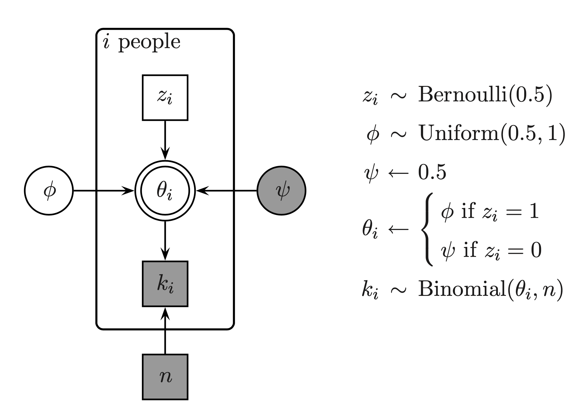
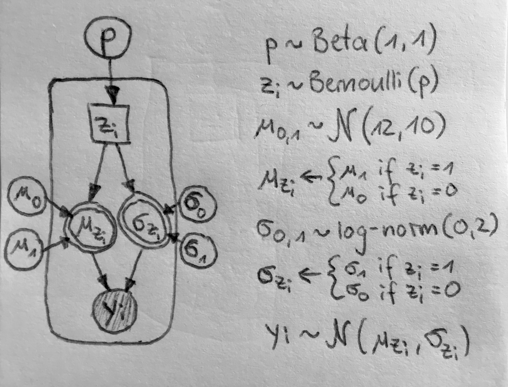
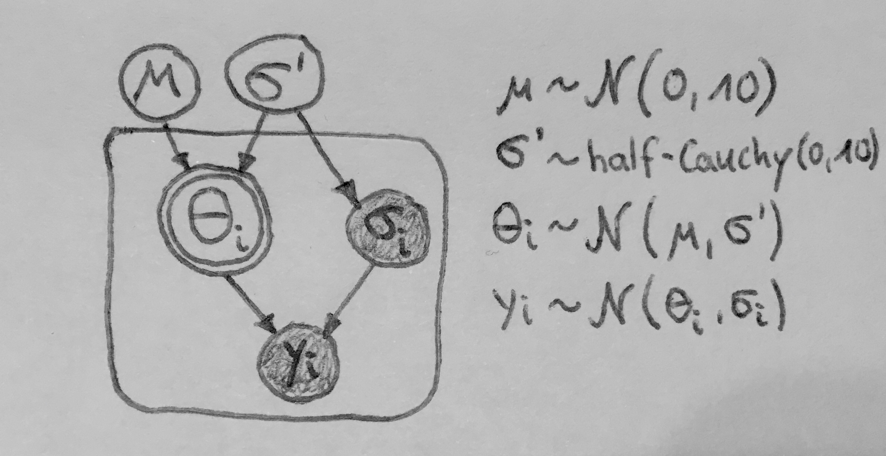

```{r setup, include=FALSE}

knitr::opts_chunk$set(echo = TRUE, cache = F, message = FALSE, warning = FALSE, error = FALSE, fig.width = 5, fig.align = "center")

```

```{r libraries, message = FALSE, warning = FALSE, include = FALSE}

# package for convenience functions (e.g. ggplot2, dplyr, etc.)
library(tidyverse)

# package for Bayesian regression modeling
library(brms)

# package for visualization
library(tidybayes)

# package to visualize 
library(bayesplot)

# package to communicate with Stan
library(rstan)

# these options help Stan run faster
options(mc.cores = parallel::detectCores())

#devtools::install_github("michael-franke/aida-package")
library(aida)

# use the aida-theme for plotting
theme_set(theme_aida())

# global color scheme / non-optimized
project_colors = c("#E69F00", "#56B4E9", "#009E73", "#F0E442", "#0072B2", "#D55E00", "#CC79A7", "#000000")

# setting theme colors globally
scale_colour_discrete <- function(...) {
  scale_colour_manual(..., values = project_colors)
}
scale_fill_discrete <- function(...) {
   scale_fill_manual(..., values = project_colors)
} 

```

# Instructions

- Use the file `09-exercises.Rmd`, solve the exercises marked as homework, and save the file with your student number and name.
- ‘Knit’ the document to produce a HTML file.
  - **include the other JS and CSS files that came with the ZIP file for this week in order to produce nicely looking Stan code in the HTML**
- **include the Stan code you write in the Rmarkdow (see example in exercise 1 below), even if you also include a seperate file to run that model from**
- Please do not suppress the code in the HTML-Output!
  - **do suppress the output of Stan by including the flag `results = "hide"` in the r chunk calling the `stan`  function**
- Create a ZIP archive called “MATRIKELNR_Lastname_Firstname_ABDA_Week9.zip” containing:
  - an R Markdown file “MATRIKELNR_Lastname_Firstname_ABDA_Week9.Rmd”
  - a knitted HTML document “MATRIKELNR_Lastname_Firstname_ABDA_Week9.html”
  - **all of your Stan code files**
  - **any pictures you add (of model graphs ...)**
  - **the auxilliary JS and CSS files for syntax highlighting of Stan code**
- Upload the ZIP archive on Stud.IP in the homework folder before the deadline. You may upload as many times as you like before the deadline, only your final submission will count.

# <span style = "color:darkgreen">1 [WALKTRHOUGH]:</span> Marginalizing out latent discrete parameters in Stan

Stan, like many other state-of-the-art Bayesian samplers, uses HMC/NUTS, but that requires the exploration of a smooth posterior surface. Out of the box, Stan is unable to treat latent discrete parameters. A solution that is often (but not always) feasible is to marginalize out these latent discrete parameters. In the following, we look at an example where inferring latent discrete parameters is an attractive modeling approach. We will then show (in math) how to "marginalize out" these discrete parameters and finally implement this in Stan.

## The 'exam scores' example

The example we look at here is the 'exam scores' case from Lee & Wagenmakers (2015, §6.1), which is also provided as part of the optional reading material (just 2 pages!) on Courseware. The idea is this. $p=15$ people answered $n=40$ exam questions. Exam questions where 2-option forced-choice questions. Every participant answered every question. The vector $k$ below contains how many out of the 40 questions each person answered correctly:

```{r}
# exam score for each person
k <- c(21,17,21,18,22,31,31,34,
       34,35,35,36,39,36,35)
#number of people
p <- length(k) 
# number of questions
n <- 40

# data as list for later use in Stan
data_exam_score <- list(k = k, p = p, n = n)
```

Here's a plot of the 'exam score' data. The $x$-axis has the participants (ordered by the sequence of occurrence in the data vector). The $y$-axis shows the proportion of correct answers.

```{r, echo = FALSE, fig.align = 'center', fig.width=4, fig.height=3,}
tibble(subject = 1:p, success.rate = k/n) %>% 
  ggplot(aes(x = subject, y = success.rate)) + 
  geom_bar(stat = "identity") +
  labs(
    x = "subject",
    y = "success rate"
  )
```

Suppose that we had reason to suspect that some people were prepared for the exam, some others were just guessing randomly. We'd like to use the data to infer: 

1. how likely it is that participant $i$ was just guessing (with chance of correctness $0.5$); and
2. what the average rate of correctly answering a question is among those who did not just guess randomly.

Notice that the first question requires reasoning about the state of a binary (hence: discrete) latent variable: whether person $i$ is a guesser or not.

Looking at the data, intuitively, we'd probably want to say something like: **the first five people were most likely guessers; the others were most likely not guessing but gave informed answers**. Let's see if we can write a Bayesian model than formalizes and tests this intuition.

The model used by Lee & Wagenmakers is shown below:

```{r, echo = F, out.width = "500px"}

```

The model features a latent discrete variable $z_i$ for each participant $i$. Depending on the value of $z_i$, the probability of answering correctly is either $0.5$ for guessers, or an unknown value $\phi$ which is to be estimated from the data.

The problem is that HMC/NUTS cannot deal with latent discrete parameters, since it wants to ride its sleigh on smooth surfaces, so to speak. That's why we do some math, to present the sampler with a smooth surface to sleigh on after all. We simply "remove" the latent discrete variables. More concretely, we compute their accumulated impact and pass that calculation back to the sampler, so that no information is lost. Here's how we do this.

## Marginalization: setting the scene

Let's start at the very beginning of Bayesian inference. We want to compute the posterior, which in non-normalized form we can write as:

$$
P(\theta \mid D) \propto P(\theta) \ P(D \mid \theta)
$$

Our sampler indeed operates by looking at what we may call the **non-normalized score** $P(\theta) \ P(D \mid \theta)$, which is on the right-hand side above, but it actually considers (for number precision), the log of that. So, at each point during the sampling the sampler is interested in this **log-score** $\log \left (P(\theta) \ P(D \mid \theta) \right)$ for different instantiations of parameter vector $\theta$. It uses this log-score to calculate the shape of the surface to sleigh on, so to speak. 

Notice that in general:

$$
\log P(\theta, D ) = \log \left(P(\theta) P(D \mid \theta) \right) = \log P(\theta) + \log P(D \mid \theta)
$$

Our goal is to write down the log-score in such a way that all discrete parameters are removed. If $\theta$ consists of $\theta'$, a vector of continuous parameters, and $\eta$ a vector of discrete parameters taking on values $\eta_1, \dots, \eta_n$, the marginalization is this:

$$
\log P(\theta', D) = \log \sum_i \left( P(\theta', \eta_i, D) \right)
$$

## Marginalization for the 'exam scores' case

Now specifically, for our concrete 'exam scores' example, the log-score is a big sum over the parts contributed by each participant $i$:

$$
\log P(D, \theta) = \sum_i \log P(k_i, n, z_i, \phi)
$$

The contribution of each single participant $i$ is:

$$\log P(k_i, n, z_i, \phi) = \log \text{Bern}(z_i \mid 0.5) + \log \text{Binom}(k_i, n, \text{ifelse}(z_i=1, \phi, 0.5))$$

Our goal is to get rid of the variable $z_i$ in this latter representation. Since each $z_i$ can only ever take on one of finitely many values (in fact: only one of two), we can therefore **marginalize out** the variables $z_i$ by a sum, so to speak, iterating over all possible values of $z_i$. We do this first here for the score, not the log-score, because that is less clutter:

$$ 
\begin{align*}
P(k_i, n, \phi) & = \sum_{z_i \in \{0,1\}} \text{Bern}(z_i \mid 0.5) \ \text{Binom}(k_i, n, \text{ifelse}(z_i=1, \phi, 0.5))  \\
                & =  \text{Bern}(0 \mid 0.5) \ \text{Binom}(k_i, n, 0.5)) + \text{Bern}(1 \mid 0.5) \ \text{Binom}(k_i, n, \phi)) \\
                & = \underbrace{0.5 \ \text{Binom}(k_i, n, 0.5))}_{\exp \alpha_0} + \underbrace{0.5 \ \text{Binom}(k_i, n, \phi))}_{\exp \alpha_1}
\end{align*}
$$

Notice that in Stan, we would represent a summand like

$$
0.5 \ \text{Binom}(k_i, n, 0.5))
$$

also as a log. (Think: Everything defaults $\log$ for numerical precision; we have functions for log-probability, not probability density/mass, for instance.) This is why we have introduced variables $\alpha_0$ and $\alpha_1$ as the log of the summands we ended up with above. To be clear:

$$
\begin{align*}
\alpha_0 &= \log 0.5 + \log \text{Binom}(k_i, n, 0.5) \\
\alpha_1 &= \log 0.5 + \log \text{Binom}(k_i, n, \phi)
\end{align*}
$$

With this, we can write the log-score contribution of each participant $i$, with $z_i$ marginalized out, as:

$$
\log P(k_i, n, \phi)   = \log \sum_{i=0}^1 \exp \alpha_i
$$

Stan has a useful built-in function `log_sum_exp` which computes exactly this last quantity for a given vector, like our $\alpha$ here. Stan's `log_sum_exp` is particularly useful because it does clever tricks in the back to ensure maximal numerical precision.

But that's it! We have expressed the (log-)score of the model without direct reference to a latent discrete variable. We did this by "enumerating and folding" all the possible cases, i.e., all the possible values the discrete variables can take on.

## Implementation in Stan

Now we can cast this into a Stan program. The code is shown below and included in file `ADA-W09-Ex1a-exam-scores.stan`. Notice that we only have a single latent parameter left, namely (continuous) $\phi$. In the `transformed parameters` we are computing the vector $\alpha$ carrying the log-summands of the marginalization, just like we expressed mathematically above. To obtain information about the marginalized-out parameters in $z$, we sample them in the `generated quantities` block. This latter sampling is independent of the computation of the posterior (it happens after having determined each next sample), but it does, of course, depend on the posterior, so these are indeed samples of $z_i$ from the posterior!

Notice also that the code includes the line `target += log_sum_exp(alpha[i]);`, which is syntax we have not seen so far. Here, the variable `target` is incremented with the log-score with $z$ marginalized out (like computed mathematically above). The variable `target` is always available in Stan. It is what contains the log-score (as far as computed so far during the execution of the program).

```{stan, output.var="Ex1-a-exam-scores", eval = F}
data { 
  int<lower=1> p;  
  int<lower=0> k[p];   
  int<lower=1> n;
}
parameters {
  real<lower=.5,upper=1> phi; 
} 
transformed parameters {
  vector[2] alpha[p];
  for (i in 1:p) {
    alpha[i,1] = log(.5) + binomial_lpmf(k[i] | n, phi);
    alpha[i,2] = log(.5) + binomial_lpmf(k[i] | n, 0.5); 
  }
}
model {
  for (i in 1:p)
    target += log_sum_exp(alpha[i]);
}
generated quantities {
  int<lower=0,upper=1> z[p];
  for (i in 1:p) {
    z[i] = bernoulli_rng(softmax(alpha[i])[1]);
  }
}
```


We can run this model as usual:

```{r, results="hide"}
stan_fit_exam_scores <- stan(
  file = 'ADA-W09-Ex1a-exam-scores.stan',
  data = data_exam_score,
  # specify which parameters to return samples from
  pars = c("phi", "z")
)
```

The most interesting piece of information is the answer to our question of how likely each participant $i$ is to be a genuine answerer or just a guesser. Here are the means of inferred values of each $z_i$:


```{r}
# extract all posterior samples for paramter z in matrix
extract(stan_fit_exam_scores)$z %>% 
  # get the mean of each colums (= mean posterior for z for each participant)
  colMeans() %>% round(3)
```

Indeed, given the data and model, we should believe that the first five people are lousy guessers. Also, posterior uncertainty about this is quite low.

# <span style = "color:firebrick">2 [HOMEWORK]:</span> Finite Mixtures

Let's look again (yawn) at our fictitious flower data. We take our measures from before but add 4 to each measure from group B (for educational reasons, as you'll see presently).

```{r}
heights_A <- c(6.94, 11.77, 8.97, 12.2, 8.48, 
               9.29, 13.03, 13.58, 7.63, 11.47, 
               10.24, 8.99, 8.29, 10.01, 9.47, 
               9.92, 6.83, 11.6, 10.29, 10.7, 
               11, 8.68, 11.71, 10.09, 9.7)

heights_B <- c(11.45, 11.89, 13.35, 11.56, 13.78, 
               12.12, 10.41, 11.99, 12.27, 13.43, 
               10.91, 9.13, 9.25, 9.94, 13.5, 
               11.26, 10.38, 13.78, 9.35, 11.67, 
               11.32, 11.98, 12.92, 12.03, 12.02) + 4
```

Here's how this data is distributed:

```{r}
ffm_data <- tibble(
  A = heights_A,
  B = heights_B
) %>% 
  pivot_longer(
    cols      = everything(),
    names_to  = 'species',
    values_to = 'height'
  )

ffm_data %>% 
  ggplot(aes(x = height)) +
  geom_density(aes(color = species), size = 2) +
  geom_rug(aes(color = species), size = 1.5) +
  theme(legend.position = 'none')
```

Now suppose that we get the data like this, without information which measure was from which group:

```{r}
flower_heights <- c(heights_A, heights_B)
tibble(flower_heights) %>% 
  ggplot(aes(x = flower_heights)) + 
  geom_rug(size = 2) +
  geom_density(size = 2)
```

Data may often look like this, showing signs of **bi- or multi-modality**, i.e., having several "humps" or apparent local areas of higher concentration. If we fit a single Gaussian to this data it might look like this:

```{r}
# using the descriptive means/SD for a quick "best fit"
mu    <- mean(flower_heights)
sigma <- sd(flower_heights)
tibble(
  source  = c(rep("data", length(flower_heights)), rep("fit", 1000)),
  height = c(flower_heights, rnorm(1000, mu, sigma))
) %>%  
ggplot(aes(x = height, fill=source)) +
  geom_density(size = 2, alpha = 0.3)


```

We are therefore trying to estimate a Gaussian mixture model (GMM). We take the simplest GMM with just two groups (because we see two "humps", or have *a priori* information that there are exactly two groups; the bonus exercise looks at a generalization to $K>2$ groups). Concretely, for each data point $y_i$, $i \in \{1, \dots, N\}$, we are going to estimate how likely data point $i$ may have been a sample from normal distribution "Number 0", with $\mu_0$ and $\sigma_0$, or from normal distribution "Number 1", with $\mu_1$ and $\sigma_1$. Naturally, all $\mu_{0,1}$ and $\sigma_{0,1}$ are estimated from the data, as are the group-indicator variables $z_i$. There is also a global parameter $p$ which indicates how likely any data point is to come from one of the two distributions (you'll think about which one below!). Here's the full model we will work with (modulo an additional ordering constraint, as discussed below):

$$
\begin{align*}
p        & \sim \text{Beta}(1,1) \\
z_i      & \sim \text{Bernoulli}(p) \\
\mu_{0,1}    & \sim \mathcal{N}(12, 10) \\
\sigma_{0,1} & \sim \text{log-normal}(0, 2) \\
y_i      & \sim \mathcal{N}(\mu_{z_i}, \sigma_{z_i})
\end{align*}
$$

## 2.a Draw the model

Draw a graphical representation of this mixture model, following the conventions outlined [here](https://michael-franke.github.io/intro-data-analysis/Chap-03-03-models-representation.html). You can draw on paper, take a picture, or draw by hand with a mouse in any drawing program (like [this](http://draw.io/)). Maybe use ASCII art. Anything is fine really! This does not need to look pretty. It just needs to be correct.

```{r, echo = F, out.width = "500px"}

```

## 2.b Run the model & interpret the output

We are going to pack the data together for fitting the Stan model:

```{r}
data_GMM <- list(
  y = flower_heights,
  N = length(flower_heights)
)
```

Below is the Stan code for this model. It is also given in file `ADA-W09-Ex2b-GMM.stan`. A few comments on this code:

1. There is no occurrence of variable $z_i$, as this is marginalized out. We do this following the same recipe as before and increment the log-score manually, using `target += log_sum_exp(alpha)`.
2. We declare vector `mu` to be of a particular type which we have not seen before. We want the vector to be ordered. We will come back to this later. Don't worry about it now.

```{stan, output.var="Ex2b-GMM", eval = F}
data {
  int<lower=1> N; 
  real y[N];      
}
parameters {
  real<lower=0,upper=1> p;         
  ordered[2] mu;             
  vector<lower=0>[2] sigma; 
}
model {
  p ~ beta(1,1);
  mu ~ normal(12, 10);
  sigma ~ lognormal(0, 1);
  for (i in 1:N) {
    vector[2] alpha;
    alpha[1] = log(p)   + normal_lpdf(y[i] | mu[1], sigma[1]);
    alpha[2] = log(1-p) + normal_lpdf(y[i] | mu[2], sigma[2]);
    target += log_sum_exp(alpha);
  }
}
```


```{r, results="hide"}
stan_fit_2b_GMM <- stan(
  file = 'ADA-W09-Ex2b-GMM.stan',
  data = data_GMM
)
```

```{r}
stan_fit_2b_GMM
```

```{r, eval = F}
shinystan::launch_shinystan(stan_fit_2b_GMM)
```

Interpret this outcome! Focus on parameters $p$, $\mu_1$ and $\mu_2$. What does $p$ capture in this implementation? Do the (mean) estimated values make sense?

**Solution:** 

The posterior mean of parameter $$p$$ indicates our posterior belief about the probability of assigning the current data point to group $$z_i = 1$$, thus taking $$\mu$$ and $$\sigma$$ from the corresponding normal distribution "number 1". The value of the sampled parameter is $$p \approx 0.54$$.
Yes, the mean estimated values for both mu parameters make sense, as they indicate the heights in our flower data which we believe are most likely to be sampled, notably also given our prior with a mean of 12 and stddev of 10 (also visually comparable with our plots above).

## 2.c An unidentifiable model

Let's run the model in file `ADA-W09-Ex2c-GMM.stan`, which is exactly the same as before but with vector `mu` being an unordered vector of reals. 

```{r, results="hide"}
stan_fit_2c_GMM <- stan(
  file = 'ADA-W09-Ex2c-GMM.stan',
  data = data_GMM,
  # set a seed for reproducible results
  seed = 1734
)
```

Here's a summary of the outcome:

```{r}
stan_fit_2c_GMM
```

Tell us what is remarkable here and explain why this happened. Explain in what sense this model is "unidentifiable".

**Hint:** Explore the parameters with high $\hat{R}$ values. When a model fit seems problematic, a nice tool to explore what might be amiss is the package `shinystan`. You could do this:

```{r, eval = F}
shinystan::launch_shinystan(stan_fit_2c_GMM)
```

Then head over to the tab "Explore" and have a look at some of the parameters.

**Solution:**

Since we did not use an ordered vector variable for mu parameters, the model is not able to capture the data appropriately. Especially, we find that the chains for parameters mu do not converge, also indicated by high autocorrelation values, as the density shows signs of bimodality. Thus the posterior estimates are not representative of the grouping in our data.

## 2.d Posterior predictive check

Extend the model from 2b to also output samples from the posterior predictive distribution. Save your code in a file `ADA-W09-Ex2d-GMM.stan`. Run the model, collect the posterior predictive samples in a variable called `yrep` and draw a density plot. Does this look like a distribution that could have generated the data? You can use the code below once the model is coded up.

```{stan, output.var="Ex2d-GMM", eval = F}
data {
  int<lower=1> N; 
  real y[N];      
}
parameters {
  real<lower=0,upper=1> p;         
  ordered[2] mu;             
  vector<lower=0>[2] sigma; 
}
model {
  p ~ beta(1,1);
  mu ~ normal(12, 10);
  sigma ~ lognormal(0, 1);
  for (i in 1:N) {
    vector[2] alpha;
    alpha[1] = log(p)   + normal_lpdf(y[i] | mu[1], sigma[1]);
    alpha[2] = log(1-p) + normal_lpdf(y[i] | mu[2], sigma[2]);
    target += log_sum_exp(alpha);
  }
}
generated quantities {
  real yrep[N];
  for(i in 1:N/2) {
    yrep[i] = normal_rng(mu[1], sigma[1]);
  }
  for(i in (N/2)+1:N) {
    yrep[i] = normal_rng(mu[2], sigma[2]);
  }
}
```

```{r, results="hide"}
stan_fit_2d_GMM <- stan(
  file = 'ADA-W09-Ex2d-GMM.stan',
  data = data_GMM,
  # only return the posterior predictive samples
  pars = c('yrep')
)
```

```{r}
stan_fit_2d_GMM
```

```{r}
tibble(
  source  = c(rep("data", length(flower_heights)), rep("PostPred", length(extract(stan_fit_2d_GMM)$yrep))),
  height = c(flower_heights, extract(stan_fit_2d_GMM)$yrep)
) %>%
ggplot(aes(x = height, fill=source)) +
  geom_density(size = 2, alpha = 0.3)
```

**Solution:**

The output of the model fit suggests convergence for the posterior predictive data; also, visually, the Gaussian mixture model seems to predict new data very well.

## 2.e Using BRMS

We can also run this finite mixture model in `brms`. We saw earlier already that fitting the parameters of a single Gaussian is like fitting an intercept-only simple linear regression model. We can add finite mixtures to `brms` like so (the syntax for creating mixtures is not so important for us right now):

```{r, results = "hide"}
brms_fit_2e_GMM <- brm(
  # intercept only model
  formula = y ~ 1, 
  data = data_GMM, 
  # declare that the likelihood should be a mixture
  family = mixture(gaussian, gaussian),
  # use weakly informative priors on mu  
  prior = c(
    prior(normal(12, 10), Intercept, dpar = mu1),
    prior(normal(12, 10), Intercept, dpar = mu2)
  )
) 
```

Let's look at the model fit:

```{r}
brms_fit_2e_GMM
```

Let's also look at the Stan code that `brms` produced in the background for this model in order to find out how this model is related to that of Ex 2.b:

```{r}
brms_fit_2e_GMM$model
```

Now, your job. Look at the two previous outputs and answer the following questions:

- Is the `brms`-model the exact same as the model in Ex 2.b?
- What is the equivalent of the variable `alpha` from the model of Ex 2.b in this new `brms`-generated code?
- What is the equivalent of the variable `p` from the model of Ex 2.b in this new `brms`-generated code?
- Is the `brms` code generating posterior predictive samples?
- What is the prior probability in the `brms`-generated model of any given data point $y_i$ to be from the first or second mixture component? Can you even tell from the code?
  
**Solution:**

- No the `brms`-model is not the same, as it, for instance, uses different prior distributions for the parameters.
- The equivalent to variable `alpha` in the `brms`-code is variable `ps`, as one can see when calculating the likelihood.
- The equivalent to variable `p` in the `brms` code is variable `theta1`.
- No, the `brms` code is not generating posterior predictive samples, as there is no such target calculation in the generated quantities block.
- Parameter`theta` is somehow sampled by the dirichlet log probability density. But this does not give us the prior probability, as theta is the vector comprising both theta1 and theta2, while just theta1 corresponds to our probability of any given data point being from the first mixture component.

# <span style = "color:firebrick">3 [HOMEWORK]:</span> Divergent transitions, and how to tame (at least some of) them

The "eight schools" example is a classic and a simple illustration of a **hierarchical model**. There are $N =8$ pairs of observations, each pair from a different school. For each school $i$, we have an estimated effect size $y_i$ and an estimated standard error $\sigma_i$ for the reported effect size. (The experiments conducted at each school which gave us these pairs investigated whether short-term coaching has a effect on SAT scores.)

```{r}
data_eight_schools <- list(
  N = 8, 
  y = c(28,  8, -3,  7, -1,  1, 18, 12),
  sigma = c(15, 10, 16, 11,  9, 11, 10, 18)
)
```

We are interested in inferring the latent true effect size $\theta_i$ for each school $i$ that could have generated the observed effect size $y_i$ given spread $\sigma_i$.

We could assume that each school's true effect size $\theta_i$ is entirely independent of any other. In contrast, we could assume that there is a single true effect size for all schools $\theta_i = \theta_j$ for all $i$ and $j$. Or, more reasonably, we let the data decide and consider a model that tries to estimate how likely it is that $\theta_i$ and $\theta_j$ for different schools $i$ and $j$ are similar or not. 

To do so, we assume a hierarchical model. The true effect sizes $\theta_i$ and $\theta_j$ of schools $i$ and $j$ are assumed:

1. to have played a role in (stochastically) generating the observed $y_i$ and $y_j$, and
2. to be themselves (stochastically) generated by (a hierarchical) process that generates (and thereby possibly assimilates) the values of $\theta_i$ and $\theta_j$.

Concretely, the model takes the following form:

$$
\begin{align*}
y_i & \sim \mathcal{N}(\theta_i, \sigma_i) \\
\theta_i & \sim \mathcal{N}(\mu, \sigma') \\
\mu & \sim \mathcal{N}(0, 10) \\
\sigma & \sim \text{half-Cauchy}(0, 10) \\
\end{align*}
$$

## 3.a Draw the model

Draw a graphical representation of this mixture model, following the conventions outlined [here](https://michael-franke.github.io/intro-data-analysis/Chap-03-03-models-representation.html). Again, any format which we can decipher easily is fine, as long as it is practical (and fun) for you.

```{r, echo = F, out.width = "500px"}

```

## 3.b Run the model, inspect and explain the divergent transitions

The Stan code for this model is shown below and also included in file `ADA-W09-Ex3a-8schools-centered.stan`. 

```{stan, output.var="Ex3a-8schoolsCentered", eval = F}
data {
  int<lower=0> N;
  vector[N] y;
  vector<lower=0>[N] sigma;
}
parameters {
  real mu;
  real<lower=0> sigma_prime;
  vector[N] theta;
}
model {
  mu ~ normal(0, 10);
  sigma_prime ~ cauchy(0, 10);
  theta ~ normal(mu, sigma_prime);
  y ~ normal(theta, sigma);
}
```

```{r, results="hide", eval = T, warnings = T}
stan_fit_3a_8schoolsC <- stan(
  file = 'ADA-W09-Ex3a-8schools-centered.stan',
  data = data_eight_schools,
  seed = 1969
)
```

Normally, there are a lot of divergent transitions when you run this code:

```{r}
get_divergent_iterations(stan_fit_3a_8schoolsC) %>% sum()
```

Let's go explore these divergent transitions using `shinystan`. Execute the command below, go to the tab "Explore" in the Shiny App, select "Bivariate" and explore plots of $\sigma'$ against $\theta_i$ for different $i$. Points that experienced divergent transitions are shown in red. 

```{r, eval = F}
shinystan::launch_shinystan(stan_fit_3a_8schoolsC)
```

You can also produce your own (funnel) plots with the code shown below, which may be even clearer because it uses a log-transform. Again, points with divergencies are shown in red. 

```{r}
 mcmc_scatter(
  as.array(stan_fit_3a_8schoolsC),
  pars = c("theta[1]", "sigma_prime"),
  transform = list(sigma_prime = "log"),
  np = nuts_params(stan_fit_3a_8schoolsC),
  size = 1
)
```

```{r}
stan_fit_3a_8schoolsC
```

Explain in your own intuitive terms why these divergent transitions occur. E.g., you might want to say something like: "Since the step size parameter is ..., we see divergencies ... because the more ... this variable is, the more/less ... that variable ..."

**Solution:**

Divergent transitions can occur, when stan uses a large step size (the size of the discretisation parts) to achieve a general global step length that fits the whole posterior distribution landscape. Now, when the posterior space that is to be explored has a too sharply curved shape the step size is too large and therefore the posterior shape cannot be captured by the sampler. In this specific 8 school example, in areas of the posterior, where one step in theta does not change a lot in sigma_prime, the steps can be larger, but for the regions where one step in theta does indeed change a lot in sigma_prime, the steps then are too large to capture the curvature appropriately, thus resulting in some divergent iterations at that location.

## 3.c Non-centered parameterization

An alternative model, with so-called non-central parameterization does not have this problem with divergent transitions (they can still occur occasionally, though).

This non-central model can be written like so:

$$
\begin{align*}
y_i & \sim \mathcal{N}(\theta_i, \sigma_i) \\
\theta_i & = \mu + \sigma' \eta_i \\
\eta_i & \sim \mathcal{N}(0, 1) \\
\mu & \sim \mathcal{N}(0, 10) \\
\sigma & \sim \text{half-Cauchy}(0, 10) \\
\end{align*}
$$

Implement and run this model in Stan. Report if you got any divergent transitions, e.g., with command `get_divergent_iterations` applied to the `stanfit` object. Store the results in variable `stan_fit_3c_8schoolsNC`.

**Solution:**

```{stan, output.var="Ex3c-8schoolsNC", eval = F}
data {
  int<lower=0> N;
  vector[N] y;
  vector<lower=0>[N] sigma;
}
parameters {
  real mu;
  real<lower=0> sigma_prime;
  vector[N] nu; // theta_raw
}
transformed parameters {
  vector[N] theta;
  theta = mu + sigma_prime*nu;
}
model {
  mu ~ normal(0, 10);
  sigma_prime ~ cauchy(0, 10);
  nu ~ normal(0, 1);
  y ~ normal(theta, sigma);
}
```

```{r, results="hide", eval = T, warnings = T}
stan_fit_3c_8schoolsNC <- stan(
  file = 'ADA-W09-Ex3c-8schoolsNC.stan',
  data = data_eight_schools
)
```

```{r}
get_divergent_iterations(stan_fit_3c_8schoolsNC) %>% sum()
```

## 3.d Explain non-central parameterization

Let's look at a plot similar to the one we looked at for the model with central parameterization in 3.b:

```{r, eval = F}
 mcmc_scatter(
  as.array(stan_fit_3c_8schoolsNC),
  pars = c("theta[1]", "sigma_prime"),
  transform = list(sigma_prime = "log"),
  np = nuts_params(stan_fit_3c_8schoolsNC),
  size = 1
)
```

```{r}
stan_fit_3c_8schoolsNC
```

What is the main striking difference (apart from the presence/absence of divergent transitions)? How is this difference a reason for why divergent transitions can be problematic? Is any estimated posterior mean for any parameter noticeably affected by this?

**Solution:**

The samples for sigma_prime against theta1 spread out downwards, since the estimated posterior for sigma_prime gets smaller in comparison to the centered model. We get the divergent transitions because we got very few data points such that the group level parameter (sigma_i) looks pretty much like the top level parameter (sigma_prime), since sigma_prime is very small. If we now want to explore the very sharp posterior space (in the 'neck'/middle rather than in the tails) and the step size is really small, we miss posterior space. We get divergent iterations when we are sampling small values for sigma_prime, thus getting a bias away from the location where sigma_prime is small. Therefore, we are led to conclude that sigma_prime is larger than it really is.

# <span style = "color:darkorange">4 [BONUS]:</span> Finite mixtures with $K>2$ groups

Let's generalize the finite mixture model of exercise 2.b to be able to deal with more than 2 mixture components. Let's do this for the following flower data:

```{r}
data_flower_heights_4 <- list(
  'y' = c(
    rnorm(25, 10, 3),
    rnorm(75, 25, 3),
    rnorm(25, 40, 3),
    rnorm(75, 65, 3)
  ),
  N = 200,
  K = 4,
  Dirichlet_prior = c(2,6,2,6)
)
```

## 4.a Implement the generalized mixture model

Pick up the code from the [Stan User's Guide](https://mc-stan.org/docs/2_23/stan-users-guide/summing-out-the-responsibility-parameter.html) on generalized finite mixtures. Change the following things:

- include a prior on `theta`, namely a Dirichlet prior with the weights as given in `data_flower_heights_4` above
- change the priors for `mu` to a normal distribution with mean 35 and SD 40
- change the priors for `sigma` to a log-normal distribution with mean 3 and spread 1

**Solution:**

<span style = "color:firebrick">Your answer here.</span>

## 4.b Make HMC converge by helpful `init`

If you run the model you might find that this model is slow to converge. Try specifying `init` values that make the model converge. This can be as blunt as you want, just make it converge (if you can). After this, comment on how useful or legit it is, in your opinion, to tweak the initialization of parameters in order to enable convergence and/or ensure a quicker, more efficient fitting with HMC.

**Solution:**

<span style = "color:firebrick">Your answer here.</span>

<link rel="stylesheet" href="hljs.css">
<script src="stan.js"></script>
<script>$('pre.stan code').each(function(i, block) {hljs.highlightBlock(block);});</script>


